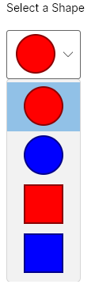

# Data Templates

 Many controls have a `Content` property, such as [`ContentControl.Content`](http://reference.avaloniaui.net/api/Avalonia.Controls/ContentControl/4B02A756). `Window` inherits from [`ContentControl`](https://docs.avaloniaui.net/docs/controls/contentcontrol), so lets use that as an example. You're probably familiar with what happens when you put a control in the `Window.Content` property - the window displays the control:

```markup
<Window xmlns="https://github.com/avaloniaui"
        xmlns:x="http://schemas.microsoft.com/winfx/2006/xaml">
  <Button HorizontalAlignment="Center"
          VerticalAlignment="Center">
    Hello World!
  </Button>
</Window>
```


Similarly if you put a string as the window content, the window will display the string:

```markup
<Window xmlns="https://github.com/avaloniaui"
        xmlns:x="http://schemas.microsoft.com/winfx/2006/xaml">
  Hello World!
</Window>
```


But what happens if you try to display an object as the window content?

```csharp
namespace Example
{
    public class Student
    {
        public Student(string firstName, string lastName)
        {
            FirstName = firstName;
            LastName = lastName;
        }

        public string FirstName { get; }
        public string LastName { get; }
    }
}
```

```markup
<Window xmlns="https://github.com/avaloniaui"
        xmlns:x="http://schemas.microsoft.com/winfx/2006/xaml"
        xmlns:local="clr-namespace:Example">
  <local:Student FirstName="Jane" LastName="Deer"/>
</Window>
```


Not very helpful. That's because Avalonia doesn't know _how_ to display an object of type `Student` - because it's not a control it falls back to just calling `.ToString()` on the object. We can tell Avalonia how to display non-control objects by defining a data template.

The easiest way to do this on `Window` \(and any control that inherits from `ContentControl`\) is to set the [`ContentTemplate`](http://reference.avaloniaui.net/api/Avalonia.Controls/ContentControl/7AA9343E) property:

```markup
<Window xmlns="https://github.com/avaloniaui"
        xmlns:x="http://schemas.microsoft.com/winfx/2006/xaml"
        xmlns:local="clr-namespace:Example">
  <Window.ContentTemplate>
    <DataTemplate>
      <StackPanel>
        <Grid ColumnDefinitions="Auto,Auto" RowDefinitions="Auto,Auto">
          <TextBlock Grid.Row="0" Grid.Column="0">First Name:</TextBlock>
          <TextBlock Grid.Row="0" Grid.Column="1" Text="{Binding FirstName}"/>
          <TextBlock Grid.Row="1" Grid.Column="0">Last Name:</TextBlock>
          <TextBlock Grid.Row="1" Grid.Column="1" Text="{Binding LastName}"/>
        </Grid>
      </StackPanel>
    </DataTemplate>
  </Window.ContentTemplate>

  <local:Student FirstName="Jane" LastName="Deer"/>
</Window>
```


The data template for the window content doesn't only come from the `ContentTemplate` property. Every control also has a `DataTemplates` collection into which any number of data templates can be placed. If a control doesn't have a template set locally \(e.g. in `ContentTemplate`\) then it will look in its `DataTemplates` collection for a matching template. If a match isn't found there it will then go on to search its parent's `DataTemplates`, then its grandparent's, and so on until it reaches the `Window`. If it _still_ hasn't found a match it will then look in `App.xaml`/`App.axaml` for a matching `DataTemplate` and finally when all those options have been exhausted it will simply call `.ToString()` on the object.

`DataTemplate`s are matched by type: the type that the template matches is specified by setting the `DataType` property on the template.

> Remember: Each `DataTemplate` in the `DataTemplates` collection should have its `DataType` set to the type of the object that it matches, otherwise the data template won't match anything!

Using the `DataTemplates` collection the previous example could be written as:

```markup
<Window xmlns="https://github.com/avaloniaui"
        xmlns:x="http://schemas.microsoft.com/winfx/2006/xaml"
        xmlns:local="clr-namespace:Example">
  <Window.DataTemplates>
    <DataTemplate DataType="{x:Type local:Student}">
      <Grid ColumnDefinitions="Auto,Auto" RowDefinitions="Auto,Auto">
        <TextBlock Grid.Row="0" Grid.Column="0">First Name:</TextBlock>
        <TextBlock Grid.Row="0" Grid.Column="1" Text="{Binding FirstName}"/>
        <TextBlock Grid.Row="1" Grid.Column="0">Last Name:</TextBlock>
        <TextBlock Grid.Row="1" Grid.Column="1" Text="{Binding LastName}"/>
      </Grid>
    </DataTemplate>
  </Window.DataTemplates>

  <local:Student FirstName="Jane" LastName="Deer"/>
</Window>
```

Using this mechanism, if you want to reuse a `DataTemplate` everywhere in a `Window` you can specify it in `Window.DataTemplates`; if you want the template to be used throughout the whole application you can specify it in `App.xaml`/`App.axaml` in the `Application.DataTemplates` collection.

Now lets add another view model into the mix:

```csharp
namespace Example
{
    public class Teacher
    {
        public Teacher(string firstName, string lastName)
        {
            FirstName = firstName;
            LastName = lastName;
        }

        public string FirstName { get; }
        public string LastName { get; }
    }
}
```

Now we can add a separate data template for the `Teacher` type and depending on the type of object in the `MainWindowViewModel.Content` property, the appropriate view will be displayed:

```markup
<Window xmlns="https://github.com/avaloniaui"
        xmlns:x="http://schemas.microsoft.com/winfx/2006/xaml"
        xmlns:local="clr-namespace:Example">
  <Window.DataTemplates>

    <DataTemplate DataType="{x:Type local:Student}">
      <Grid ColumnDefinitions="Auto,Auto" RowDefinitions="Auto,Auto">
        <TextBlock Grid.Row="0" Grid.Column="0">First Name:</TextBlock>
        <TextBlock Grid.Row="0" Grid.Column="1" Text="{Binding FirstName}"/>
        <TextBlock Grid.Row="1" Grid.Column="0">Last Name:</TextBlock>
        <TextBlock Grid.Row="1" Grid.Column="1" Text="{Binding LastName}"/>
      </Grid>
    </DataTemplate>

    <DataTemplate DataType="{x:Type local:Teacher}">
      <Grid ColumnDefinitions="Auto,4,Auto">
        <TextBlock Grid.Row="0" Grid.Column="0">Professor</TextBlock>
        <TextBlock Grid.Row="0" Grid.Column="2" Text="{Binding LastName}"/>
      </Grid>
    </DataTemplate>

  </Window.DataTemplates>

  <ContentControl Content="{Binding Content}"/>
</Window>
```

### Evaluation Order <a id="evaluation-order"></a>

Data templates in Avalonia can target interfaces and derived classes and so the order of DataTemplates can be important: DataTemplates within the same collection are evaluated in declaration order so you need to place them from most-specific to least-specific as you would in code.

## Implementing IDataTemplate for advanced scenarios

If you need more control over your `DataTemplate` you can do this by creating a class which implements the `IDataTemplate`-interface. With this interface you can create your own `DataTemplate` not only respecting the `DataType` of your data, but also its properties or whatever you like. 

To use this interface you must implement the following two members in your class:
- `public bool Match(object data) { ... }` you need to check in this method if the provided data is matches by your `IDataTemplate` or not. You need to return true if the data matches, otherwise false.
- `public IControl Build(object param) { ... }` In this method you need to build and return the control which represents your data. 

### Basic Example

Below is a very basic sample implementation of the `IDataTemplate`-interface:

```csharp
public class MyDataTemplate : IDataTemplate
{
    public IControl Build(object param)
    {
        // build the control to display
        return new TextBlock() { Text = (string)param };
    }

    public bool Match(object data)
    {
        // Check if we can accept the provided data
        return data is string;
    }
}
```

You can now use the class `MyDataTemplate` in your view like this:

```xml
<!-- remember to add the needed prefix in your view -->
<!-- xmlns:dataTemplates="using:MyApp.DataTemplates" -->

<ContentControl Content="{Binding MyContent}">
	<ContentControl.ContentTemplate>
		<dataTemplates:MyDataTemplate />
	</ContentControl.ContentTemplate>
</ContentControl>
```


### Advanced Example

Sometimes you may want to display a different Control for different states of your `ViewModel`. Let's assume you have a Property which is an `enum` called `ShapeType`, defined like this:

```csharp
public enum ShapeType
{
    RedCircle,
    RedSquare, 
    BlueCircle,
    BlueSquare
}
```

We use this `enum` in our `ViewModel` as a property:

```csharp
// In our sample we use ReactiveUI but you don't need to do it.

private ShapeType _ShapeType;
/// <summary>
/// Gets or sets the shape type to display
/// </summary>
public ShapeType ShapeType
{
    get { return _ShapeType; }
    set { this.RaiseAndSetIfChanged(ref _ShapeType, value); }
}
```

In our view we want to show a red circle if the user selects `ShapeType.RedCircle` and we want to show a blue square if the user selects `ShapeType.BlueSquare`. To achieve this will create a class called `ShapesTemplateSelector`, where have a `Dictionary` which stores the shape representations we want to look up.

```csharp
public class ShapesTemplateSelector : IDataTemplate
{
    // This Dictionary should store our shapes. We mark this as [Content], so we can directly add elements to it later.
    [Content]
    public Dictionary<string, IDataTemplate> AvailableTemplates { get; } = new Dictionary<string, IDataTemplate>();

    // Build the DataTemplate here
    public IControl Build(object param)
    {
        var key = param.ToString(); // Our Keys in the dictionary are strings, so we call .ToString() to get the key to look up
        if(key is null) // If the key is null, we throw an ArgumentNullException
        {
            throw new ArgumentNullException(nameof(param));
        }
        return AvailableTemplates[key].Build(param); // finally we look up the provided key and let the System build the DataTemplate for us
    }

    // Check if we can accept the provided data
    public bool Match(object data)
    {
         // Our Keys in the dictionary are strings, so we call .ToString() to get the key to look up
        var key = data.ToString(); 
        
        return data is ShapesEnum                      // the provided data needs to be our enum type
               && !string.IsNullOrEmpty(key)           // and the key must not be null or empty
               && AvailableTemplates.ContainsKey(key); // and the key must be found in our Dictionary
    }
}
```

Now we will setup the `ShapesTemplateSelector` in the `DataTemplates`-section of our `App.axaml`: 

```xml
<!-- remember to add the needed prefix in your view -->
<!-- xmlns:dataTemplates="using:MyApp.DataTemplates" -->
<!-- xmlns:model="using:MyApp.Model" -->

<Application.DataTemplates>
	<dataTemplates:ShapesTemplateSelector>
		<DataTemplate x:Key="RedCircle" DataType="model:ShapesEnum">
			<Ellipse Width="50" Height="50" Fill="Red" Stroke="DarkRed" StrokeThickness="2" />
		</DataTemplate>
		<DataTemplate x:Key="BlueCircle" DataType="model:ShapesEnum">
			<Ellipse  Width="50" Height="50" Fill="Blue" Stroke="DarkBlue" StrokeThickness="2" />
		</DataTemplate>
		<DataTemplate x:Key="RedSquare" DataType="model:ShapesEnum">
			<Rectangle  Width="50" Height="50" Fill="Red" Stroke="DarkRed" StrokeThickness="2" />
		</DataTemplate>
		<DataTemplate x:Key="BlueSquare" DataType="model:ShapesEnum">
			<Rectangle  Width="50" Height="50" Fill="Blue" Stroke="DarkBlue" StrokeThickness="2" />
		</DataTemplate>
	</dataTemplates:ShapesTemplateSelector>
</Application.DataTemplates>
```

Now we can will create a `ComboBox` which the user can use to select a `ShapeType`:

```xml
<!-- remember to add the needed prefix in your view -->
<!-- xmlns:model="using:MyApp.Model" -->

<StackPanel>

	<TextBlock Text="Select a Shape" />

	<ComboBox SelectedIndex="0">
		<model:ShapeType>RedCircle</model:ShapeType>
		<model:ShapeType>BlueCircle</model:ShapeType>
		<model:ShapeType>RedSquare</model:ShapeType>
		<model:ShapeType>BlueSquare</model:ShapeType>
	</ComboBox>
</StackPanel>
```

Our final result looks like this: 

